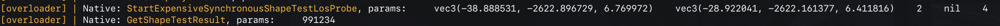
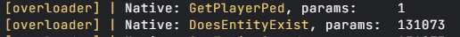

#  Natives Overloader for CitizenFX

⚠️ **Note:** This repository and use is purely for educational purposes and in no way encourages violation of the Terms of Use, Conditions, Creator Platform License Agreement, or any other terms of the [Cfx.re](https://cfx.res/) platform. The author is not liable for any damages caused to third parties.

Code that overloads all current documented natives and prints them to the console when used with certain arguments. The main use is in combination with escrow scripts for research and possible optimization by overloading.

## ⚠️ Performance issues

Overloading can cause significant problems with script optimization. For example, when overloading `Wait`, your CPU Time in resource monitor may increase due to the use of `print`.

All native functions **should** still work and printing them **should** not affect functionality.

## Usage

### Registering file

File `natives_overloader.lua` must be registered in `fxmanifest.lua` metadata of script where you want to get information about used natives.

```lua
fx_version 'cerulean'
game 'gta5'

-- ⚠️ The file must be registered above all other files for overloading all natives.
shared_script 'natives_overloader.lua'

client_scripts {
    'client/cl-main.lua',
    'editable/cl-*.lua'
}

server_scripts {
    'server/sv-main.lua',
    'editable/sv-*.lua'
}

escrow_ignore {
    'editable/*.lua'
}
```

After registering the file, just connect to the server and restart the script, e.g. with `ensure` command, because without you present on the server any natives for the client won't load and won't be printed in your client console.

### Ignore overload specific natives

Because of the frequent use of some of the natives you can ignore overload of certain ones. In `natives_overloader.lua` there is table constant `IGNORE_NATIVES` where the list of ignored natives can be edited.

```lua
IGNORE_NATIVES = {
    ['Wait'] = true
}
```

### Example

#### Client



#### Server


